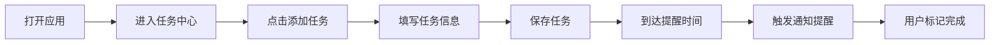
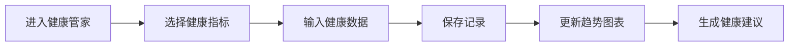

## 1. 产品概述

个人管家AI应用是一款集任务定时提醒与健康管理于一体的智能生活助手，帮助用户高效管理日常事务，同时关注身体健康状态。

- **核心目标**：通过智能化的任务提醒和健康监测，提升用户生活品质和工作效率
- **目标用户**：注重效率管理和健康生活的都市人群、学生、职场人士
- **产品价值**：一个应用搞定时间管理与健康追踪，让生活更有序、更健康

## 2. 核心功能

### 2.1 用户角色

| 角色 | 注册方式 | 核心权限 |
|------|----------|----------|
| 普通用户 | 本地存储，无需注册 | 创建任务、设置提醒、记录健康数据、查看统计分析 |

### 2.2 功能模块

1. **仪表盘首页**：今日概览、任务状态、健康数据摘要、AI助手入口
2. **任务提醒中心**：任务列表、添加/编辑任务、定时提醒、重复提醒、分类管理
3. **健康管家**：健康数据记录（饮水、运动、睡眠、体重）、健康趋势图表、健康建议
4. **AI智能助手**：对话式交互、智能任务创建、健康咨询建议

### 2.3 页面详情

| 页面名称 | 模块名称 | 功能描述 |
|---------|----------|----------|
| 仪表盘首页 | 顶部导航 | 应用logo、页面切换标签、设置入口 |
| 仪表盘首页 | 今日概览卡片 | 显示日期、问候语、今日待办数量、已完成数量 |
| 仪表盘首页 | 任务进度环 | 环形进度图展示今日任务完成率 |
| 仪表盘首页 | 健康摘要卡片 | 今日步数、饮水量、睡眠时长简要展示 |
| 仪表盘首页 | 即将到来提醒 | 列出最近3个待提醒的任务 |
| 任务提醒中心 | 任务分类标签 | 全部/工作/生活/学习/其他分类切换 |
| 任务提醒中心 | 任务列表 | 任务项（标题、时间、状态、优先级）、完成勾选、删除操作 |
| 任务提醒中心 | 添加任务悬浮按钮 | 点击弹出任务创建表单 |
| 任务提醒中心 | 任务创建/编辑弹窗 | 任务标题、描述、时间、重复周期、优先级、提醒设置 |
| 健康管家 | 健康数据概览 | 四大健康指标卡片（饮水、运动、睡眠、体重） |
| 健康管家 | 数据记录操作 | 快速记录饮水、添加运动、记录睡眠、更新体重 |
| 健康管家 | 趋势图表 | 近7天健康数据趋势折线图/柱状图 |
| 健康管家 | 健康建议 | AI生成的个性化健康建议卡片 |
| AI助手 | 对话界面 | 消息列表、输入框、发送按钮 |
| AI助手 | 快捷指令 | 常用快捷指令（创建任务、健康建议、日程安排） |

## 3. 核心流程

### 3.1 任务提醒流程

用户打开应用 → 进入任务提醒中心 → 点击添加任务 → 填写任务信息（标题、时间、重复周期、优先级）→ 保存任务 → 到达提醒时间触发通知 → 用户标记完成/推迟

### 3.2 健康数据记录流程

用户进入健康管家 → 选择健康指标 → 输入/选择数据 → 保存记录 → 查看趋势图表 → 获取健康建议

## 4. 用户界面设计

### 4.1 设计风格

- **设计理念**：温暖有机科技感 —— 圆润柔和的形态搭配渐变色彩，营造舒适安心的使用体验
- **主色调**：暖橙色渐变（#FF9A56 → #FF6B35）—— 代表活力与温暖
- **辅助色**：薄荷绿（#4ECDC4）用于健康模块、薰衣草紫（#9B88FF）用于AI助手
- **中性色**：米白背景（#FAF8F5）、深灰文字（#2D3436）、浅灰分割线（#E8E4DF）
- **按钮风格**：全圆角胶囊按钮，渐变填充，悬浮时有微上浮和阴影加深效果
- **字体**：标题使用「Playfair Display」优雅衬线体，正文使用「Noto Sans SC」简洁无衬线体
- **布局风格**：卡片式布局，大圆角（16px），柔和投影，玻璃拟态效果点缀
- **图标风格**：圆润线性图标，搭配柔和色块背景
- **动效**：页面切换淡入淡出，卡片悬浮微弹，数据变化有数字滚动动画

### 4.2 页面设计概览

| 页面名称 | 模块名称 | UI元素 |
|---------|----------|--------|
| 仪表盘首页 | 顶部问候区 | 渐变背景、动态问候语、日期显示、装饰性几何图形 |
| 仪表盘首页 | 数据概览区 | 双列卡片网格、图标+数字+趋势箭头、微动效 |
| 仪表盘首页 | 今日任务 | 任务进度环动画、任务列表、渐变色完成条 |
| 仪表盘首页 | 快捷入口 | 四个圆形快捷按钮、悬停旋转效果 |
| 任务提醒中心 | 分类标签栏 | 横向滚动标签、选中态渐变背景下划线 |
| 任务提醒中心 | 任务卡片列表 | 左对齐优先级色条、任务标题、时间标签、完成复选框 |
| 任务提醒中心 | 添加按钮 | 右下角悬浮渐变圆形按钮、+号旋转动画 |
| 任务提醒中心 | 任务表单弹窗 | 毛玻璃背景、表单输入框、时间选择器、滑动开关 |
| 健康管家 | 指标卡片 | 四大健康指标大卡片、渐变色图标背景、快速加减按钮 |
| 健康管家 | 趋势图表 | 渐变色面积图、动画绘制效果、可切换时间维度 |
| 健康管家 | 建议卡片 | 左色条设计、AI建议文字、阅读更多按钮 |
| AI助手 | 对话界面 | 气泡式对话、用户消息右对齐、AI消息左对齐带头像 |
| AI助手 | 输入区域 | 底部固定输入栏、渐变发送按钮、快捷指令标签 |

### 4.3 响应式设计

- **设计策略**：桌面端优先，移动端自适应，两端体验同步维护
- **开发原则**：任何界面修改、新增模块必须同时适配桌面端和移动端
- **断点设置**：
  - 桌面端（≥1024px）：三栏布局，侧边导航 + 主内容区 + 信息面板
  - 平板端（768px-1023px）：两栏布局，顶部导航 + 主内容区
  - 移动端（<768px）：单栏布局，底部标签栏导航，卡片全宽展示
- **触控优化**：移动端按钮尺寸≥44px，列表项增大点击区域，支持滑动操作
- **双端验证**：每次功能迭代必须同时验证桌面端和移动端显示效果
