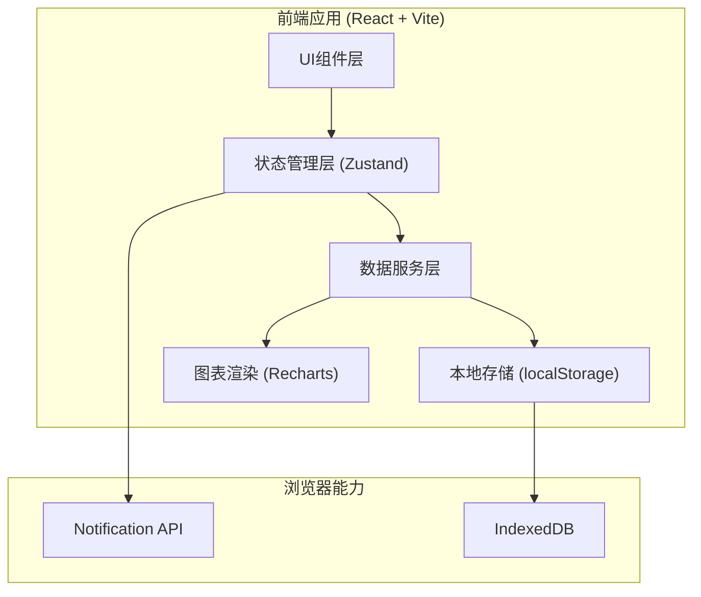
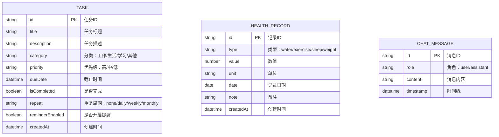

## 1. 架构设计

本应用为纯前端单页应用，数据存储在浏览器本地（localStorage），无需后端服务。AI助手功能使用模拟数据实现智能回复效果。



## 2. 技术描述

- **前端框架**：React@18 + TypeScript
- **构建工具**：Vite@5
- **样式方案**：TailwindCSS@3 + CSS变量
- **状态管理**：Zustand（轻量级状态管理）
- **路由管理**：React Router@6
- **图表库**：Recharts（React图表组件库）
- **图标库**：Lucide React（圆润线性图标）
- **动画库**：Framer Motion（流畅动画效果）
- **数据存储**：localStorage（本地持久化）
- **后端服务**：无（纯前端应用，使用模拟数据）
- **数据库**：无（使用浏览器本地存储）

## 3. 路由定义

| 路由路径 | 页面名称 | 页面说明 |
|---------|----------|----------|
| /dashboard | 仪表盘首页 | 今日概览、任务进度、健康摘要 |
| /tasks | 任务提醒中心 | 任务列表、添加/编辑任务、分类管理 |
| /health | 健康管家 | 健康数据记录、趋势图表、健康建议 |
| /assistant | AI助手 | 对话界面、快捷指令 |

## 4. 数据模型

### 4.1 数据模型定义



### 4.2 数据存储结构

```typescript
// Task 任务类型
interface Task {
  id: string;
  title: string;
  description: string;
  category: 'work' | 'life' | 'study' | 'other';
  priority: 'high' | 'medium' | 'low';
  dueDate: string; // ISO date string
  isCompleted: boolean;
  repeat: 'none' | 'daily' | 'weekly' | 'monthly';
  reminderEnabled: boolean;
  createdAt: string;
}

// HealthRecord 健康记录类型
interface HealthRecord {
  id: string;
  type: 'water' | 'exercise' | 'sleep' | 'weight';
  value: number;
  unit: string;
  date: string; // YYYY-MM-DD
  note?: string;
  createdAt: string;
}

// ChatMessage 聊天消息类型
interface ChatMessage {
  id: string;
  role: 'user' | 'assistant';
  content: string;
  timestamp: string;
}

// AppState 应用状态
interface AppState {
  tasks: Task[];
  healthRecords: HealthRecord[];
  chatMessages: ChatMessage[];
  settings: {
    theme: 'light' | 'dark';
    notificationEnabled: boolean;
  };
}
```

## 5. 核心模块说明

### 5.1 任务提醒模块

- **任务CRUD**：创建、读取、更新、删除任务
- **分类管理**：按工作/生活/学习/其他分类筛选
- **提醒功能**：基于浏览器 Notification API 实现定时提醒
- **重复任务**：支持每日/每周/每月重复的任务生成

### 5.2 健康管理模块

- **数据记录**：饮水、运动、睡眠、体重四大指标记录
- **趋势图表**：使用 Recharts 绘制7天/30天数据趋势
- **健康建议**：基于用户数据生成个性化健康建议（模拟AI生成）

### 5.3 AI助手模块

- **对话界面**：气泡式聊天界面
- **快捷指令**：快速触发常用功能
- **智能回复**：基于规则的模拟AI回复，支持任务创建、健康咨询等

### 5.4 状态管理模块

- 使用 Zustand 管理全局状态
- 状态变更自动同步到 localStorage
- 支持数据持久化和页面刷新恢复
